# AI Developer Tools MCP Server

**Educational reference implementation demonstrating how to build MCP servers as bridges to existing REST APIs.**

This MCP server shows how to expose AI development tool intelligence through the Model Context Protocol (MCP) by wrapping a REST API with a conversational interface. It's designed as a learning resource for developers who want to understand the MCP-as-API-bridge pattern.

[](https://github.com/modelcontextprotocol)
[](https://opensource.org/licenses/MIT)
[](https://nodejs.org)

---

## Architecture: MCP as an API Bridge

This project demonstrates the **recommended pattern** for MCP servers: wrapping an existing REST API to provide conversational access, rather than building everything from scratch.

### The Pattern

```mermaid
graph TB
    subgraph " "
        DB[(Database<br/>PostgreSQL)]
        API[REST API<br/>Business Logic<br/>Auth • Rate Limiting • Caching]
        DB --> API
    end
    
    API --> |JSON| DEV[Direct API Access]
    API --> |Bridge| MCP[MCP Server<br/>~200 lines<br/>Format JSON → NL]
    
    DEV --> DEVS[👨‍💻 Developers<br/>Programmatic Access]
    MCP --> USERS[💬 Users + Claude<br/>Conversational Access]
    
    style DB fill:#e8f5e9,stroke:#43a047
    style API fill:#e3f2fd,stroke:#1976d2,stroke-width:3px
    style DEV fill:#fff3e0,stroke:#f57c00
    style MCP fill:#f3e5f5,stroke:#7b1fa2,stroke-width:2px
    style DEVS fill:#fff3e0,stroke:#f57c00
    style USERS fill:#f3e5f5,stroke:#7b1fa2
```


### Why This Architecture?

**Single Source of Truth**
- All business logic lives in the REST API
- Authentication, rate limiting, caching happen once
- API changes automatically flow through to MCP

**Dual Access Patterns**
- Developers use API directly for programmatic access
- Non-technical users get conversational access via Claude
- Same data, different interfaces for different needs

**Thin Wrapper**
- MCP server is ~200 lines of formatting code
- Calls existing API endpoints
- Transforms JSON responses → natural language
- Easy to maintain and extend

### What It Does

This MCP server makes AI development tool intelligence accessible through natural conversation with Claude. Instead of manually querying APIs or clicking through dashboards, you can ask:

**Example Queries:**

* *"Compare the adoption of OpenAI SDK vs Anthropic SDK"*
* *"What are the fastest-growing AI coding tools this month?"*
* *"Show me the growth history of Cursor over the last 6 months"*
* *"Find all LLM API frameworks with over 5M downloads"*

Claude uses the exposed tools to fetch data and present insights in natural language, complete with growth trends, community metrics, and comparative analysis.

**What Data Is Exposed:**

* NPM download statistics (weekly/monthly)
* GitHub repository metrics (stars, activity)
* Community engagement (Stack Overflow questions, Reddit mentions)
* Historical growth trends
* Tool metadata (descriptions, categories, package names)

---

## Code Structure
```
ai-developer-tools-mcp/
├── src/
│   ├── index.js           # MCP server entry point
│   ├── tools/             # MCP tool definitions
│   │   ├── compare.js     # Compare multiple tools
│   │   ├── trending.js    # Get trending tools
│   │   ├── history.js     # Historical data
│   │   └── search.js      # Search/filter tools
│   ├── api/               # API client layer (THE BRIDGE)
│   │   └── client.js      # Simulates REST API calls
│   ├── data/              # Mock data (simulates database)
│   │   └── mock-data.js   # Sample data
│   └── utils/             # Formatters
│       └── formatters.js  # JSON → Natural language
├── test/
│   └── test-tools.js      # Test suite
├── .env.example
├── package.json
└── README.md
```

### Key Layers

**1. MCP Tools (`src/tools/`)** 
- Define what Claude can call
- Receive structured parameters from Claude
- Call the API client
- Return formatted responses

**2. API Client (`src/api/client.js`)** ⭐ **THE BRIDGE**
- Simulates REST API calls in this demo
- In production: makes real HTTP requests
- Handles authentication, errors, timeouts
- Returns JSON responses

**3. Formatters (`src/utils/formatters.js`)**
- Transform JSON → Natural language
- Add insights and context
- Make data conversational
- This is where MCP adds value

**4. Mock Data (`src/data/mock-data.js`)**
- Simulates database responses
- Representative sample data
- In production: replaced by real database

---

## Production vs Demo

### Demo (This Repo)

**API Client (`src/api/client.js`):**
```javascript
async getToolMetrics(toolId) {
  // Simulate network delay
  await this._simulateNetworkDelay();
  
  // Return mock data
  const data = mockData.getCurrentMetrics(toolId);
  return this._successResponse(data);
}
```

**What it demonstrates:**
- MCP tool → API client → Data source pattern
- Request/response flow
- Error handling
- Response formatting

### Production (vibe-data.com)

**API Client:**
```javascript
async getToolMetrics(toolId) {
  // Make real HTTP request
  const response = await fetch(
    `${this.baseURL}/tools/${toolId}/metrics`,
    {
      headers: {
        'Authorization': `Bearer ${this.apiKey}`,
        'Content-Type': 'application/json'
      },
      timeout: this.timeout
    }
  );
  
  if (!response.ok) {
    throw new Error(`API error: ${response.status}`);
  }
  
  return await response.json();
}
```

**What changes:**
- `fetch()` instead of mock data
- Real authentication headers
- Actual timeout handling
- Production error handling
- Rate limiting
- Retry logic

**Everything else stays the same:**
- MCP tool definitions ✓
- Response formatters ✓
- Tool parameter schemas ✓
- MCP server setup ✓

---

## Quick Start

### Prerequisites

* Node.js 18 or higher
* Claude Desktop app (or any MCP-compatible client)

### Installation
```bash
# Clone the repository
git clone https://github.com/grzetich/ai-developer-tools-mcp.git
cd ai-developer-tools-mcp

# Install dependencies
npm install

# (Optional) Copy and configure environment variables
cp .env.example .env
```

### Running the Server

**Option 1: Standalone Testing**
```bash
# Run the server in stdio mode
npm start

# Or run tests to verify all tools work
npm test
```

**Option 2: Connect to Claude Desktop**

Add this configuration to your Claude Desktop config file:

**macOS:** `~/Library/Application Support/Claude/claude_desktop_config.json`
**Windows:** `%APPDATA%\Claude\claude_desktop_config.json`
```json
{
  "mcpServers": {
    "ai-developer-tools": {
      "command": "node",
      "args": ["/absolute/path/to/ai-developer-tools-mcp/src/index.js"]
    }
  }
}
```

Restart Claude Desktop. You should see the server listed in the MCP section.

### Testing It Works

Ask Claude:

> *"What are the most popular AI coding tools right now?"*

Claude will use the `get_trending_tools` tool to fetch current data and present it to you.

---

## How The Bridge Pattern Works

### Request Flow


### Code Example

**User asks:** "What's Cursor's adoption trend?"

**1. Claude decides to call the tool:**
```json
{
  "tool": "get_tool_history",
  "arguments": {
    "tool": "cursor",
    "months": 6
  }
}
```

**2. MCP tool receives call:**
```javascript
// src/tools/history.js
async execute(args) {
  const { tool, months } = args;
  
  // Call API client
  const response = await apiClient.getToolHistory(tool, months);
  
  // Format JSON → Natural language
  return formatHistory(response.data, tool, months);
}
```

**3. API client makes request:**
```javascript
// src/api/client.js
async getToolHistory(toolId, months) {
  // In demo: return mock data
  // In production: fetch(`${baseURL}/tools/${toolId}/history?months=${months}`)
  
  const data = mockData.getHistoricalData(toolId, months);
  return this._successResponse({ tool_id: toolId, data });
}
```

**4. Formatter transforms response:**
```javascript
// src/utils/formatters.js
export function formatHistory(apiResponse, toolId, months) {
  const { data } = apiResponse;
  
  let output = `📈 ${toolId.toUpperCase()} - ${months} Month History\n\n`;
  
  data.forEach(point => {
    output += `${point.month}: ${formatNumber(point.downloads)} downloads\n`;
  });
  
  const growth = calculateGrowth(data);
  output += `\n**Growth:** ${growth}% over ${months} months\n`;
  
  return output;
}
```

**5. Claude presents to user:**
"Based on the data, Cursor has shown strong growth over the last 6 months, with downloads increasing from 5.2M to 8.1M (55.8% growth)..."

---

## Available Tools

### 1. `compare_tools`

Compare adoption metrics between 2-3 AI developer tools

**Parameters:**
```json
{
  "tools": ["openai", "anthropic"],
  "time_range": "30d"
}
```

**Returns:** Side-by-side comparison with growth indicators and key insights

---

### 2. `get_trending_tools`

Get the fastest-growing AI developer tools

**Parameters:**
```json
{
  "time_range": "30d",
  "limit": 5,
  "category": "llm-api"
}
```

**Returns:** Ranked list by growth percentage with current metrics

---

### 3. `get_tool_history`

Get historical adoption data for a specific tool

**Parameters:**
```json
{
  "tool": "cursor",
  "months": 6
}
```

**Returns:** Monthly timeline with growth analysis

---

### 4. `search_tools`

Search and filter tools by criteria

**Parameters:**
```json
{
  "category": "llm-api",
  "min_downloads": 10000000,
  "sort_by": "downloads"
}
```

**Returns:** Filtered list with full details and summary stats

---

## Migrating to Production

### Step 1: Update API Client

Replace mock calls with real HTTP requests:
```javascript
// src/api/client.js

class ApiClient {
  constructor(baseURL, options = {}) {
    this.baseURL = baseURL;
    this.apiKey = options.apiKey;
    this.timeout = options.timeout || 5000;
  }

  async getToolMetrics(toolId) {
    try {
      const response = await fetch(
        `${this.baseURL}/tools/${toolId}/metrics`,
        {
          headers: {
            'Authorization': `Bearer ${this.apiKey}`,
            'Content-Type': 'application/json'
          },
          signal: AbortSignal.timeout(this.timeout)
        }
      );

      if (!response.ok) {
        throw new Error(`HTTP ${response.status}: ${response.statusText}`);
      }

      const data = await response.json();
      return this._successResponse(data);
      
    } catch (error) {
      if (error.name === 'AbortError') {
        return this._errorResponse(408, 'Request timeout');
      }
      return this._errorResponse(500, error.message);
    }
  }
  
  // ... implement other methods similarly
}

// Configure with environment variables
export const apiClient = new ApiClient(
  process.env.API_BASE_URL || 'https://api.vibe-data.com',
  {
    apiKey: process.env.API_KEY,
    timeout: parseInt(process.env.API_TIMEOUT) || 5000
  }
);
```

### Step 2: Add Authentication
```javascript
// .env
API_BASE_URL=https://api.vibe-data.com
API_KEY=your_api_key_here
API_TIMEOUT=5000
```

### Step 3: Add Rate Limiting
```javascript
// src/api/client.js

class ApiClient {
  constructor(baseURL, options = {}) {
    this.baseURL = baseURL;
    this.apiKey = options.apiKey;
    this.rateLimiter = new RateLimiter(options.rateLimit || 100); // 100 requests/min
  }

  async getToolMetrics(toolId) {
    // Wait for rate limit
    await this.rateLimiter.wait();
    
    // Make request...
  }
}
```

### Step 4: Add Retry Logic
```javascript
async getToolMetrics(toolId, retries = 3) {
  for (let i = 0; i < retries; i++) {
    try {
      const response = await fetch(/* ... */);
      return response;
    } catch (error) {
      if (i === retries - 1) throw error;
      await this._exponentialBackoff(i);
    }
  }
}

_exponentialBackoff(attempt) {
  const delay = Math.min(1000 * Math.pow(2, attempt), 10000);
  return new Promise(resolve => setTimeout(resolve, delay));
}
```

### Step 5: Test

Everything else (tools, formatters, MCP server) stays the same.

---

## Design Decisions

### Why Wrap an API Instead of Direct Database Access?

**Separation of Concerns:**
- API handles business logic, auth, rate limiting
- MCP server focuses on conversation formatting
- Don't duplicate logic in both places

**Security:**
- API is your security boundary
- MCP server doesn't need database credentials
- Same security rules apply to all clients

**Maintainability:**
- One codebase for business logic
- API changes flow through automatically
- MCP layer is thin and simple

### Why Format Responses as Text?

**Claude Excels at Language:**
- Language models work best with text, not JSON
- No parsing needed - Claude can directly quote or summarize
- More flexible - Claude can adapt presentation to context

**Better User Experience:**
- Users see insights, not data structures
- Natural conversation flow
- Context and interpretation included

**Example:**

**JSON response:**
```json
{"downloads": 8100000, "growth_pct": 55.8}
```

**Formatted text:**
```
Cursor grew 55% over the quarter, reaching 8.1M monthly 
downloads, indicating strong developer adoption.
```

Same data, but one is for machines and one is for humans.

### Why One Tool Per Function?

**Claude Performs Better:**
- Clear, focused tools are easier for Claude to choose
- Simpler parameter schemas
- More predictable behavior

**Easier to Maintain:**
- Each tool has one responsibility
- Independent testing
- Clear documentation

**Composable:**
- Claude can chain multiple tool calls
- "Compare top 3 trending tools" = `get_trending` + `compare_tools`

---

## Real-World Use Cases

This pattern works for any product with queryable data:

### B2B SaaS
- **API:** Analytics platforms, customer dashboards
- **MCP:** *"How's our MRR trending?"* *"Which customers churned?"*

### E-commerce
- **API:** Inventory systems, order management
- **MCP:** *"What products are low stock?"* *"Show me returns this week"*

### Internal Tools
- **API:** Automated reports, integrations
- **MCP:** *"Find pending invoices"* *"Compare Q3 vs Q4 sales"*

---

## Contributing

Contributions welcome! This is an educational project, so quality over quantity.

**Good Contributions:**
* Additional tools with clear use cases
* Better mock data demonstrating edge cases
* Documentation improvements
* Examples of production implementations
* Testing improvements

**Please Open an Issue First** to discuss:
* Major architectural changes
* New dependencies
* Breaking changes to tool interfaces

---

## License

MIT License - see [LICENSE](LICENSE) file for details.

---

## Acknowledgments

* Built with the [Model Context Protocol](https://github.com/modelcontextprotocol) by Anthropic
* Inspired by real production data platform at [Vibe Data](https://vibe-data.com)
* Created as an educational resource for the AI developer community

---

## Learn More

* [MCP Documentation](https://github.com/modelcontextprotocol/docs)
* [Claude Desktop MCP Setup](https://docs.anthropic.com/claude/docs/model-context-protocol)
* [Production Implementation: Vibe Data](https://vibe-data.com)
* [Blog: Building MCP Servers as API Bridges](https://grzeti.ch/blog)

---

**Questions? Issues? Ideas?**
[Open an issue](https://github.com/grzetich/ai-developer-tools-mcp/issues) or reach out!